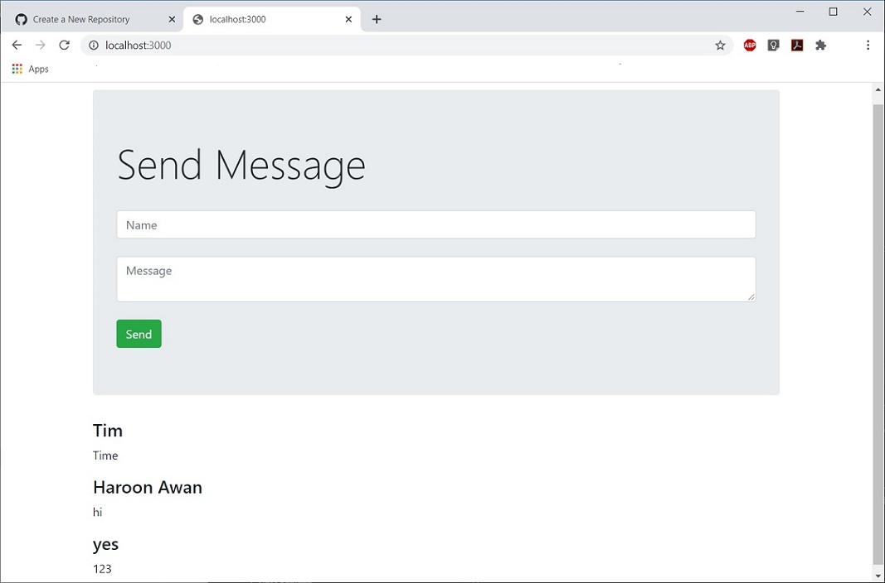

# chatbox-nodeJS
### A simple dynamic chat box built using MondgoDB, expressJS, bootstrap and nodeJS

**This is an example of full stack web app.**

- Front-end: Bootstrap and HTML
- Back-end: NodeJs
- Server: expressJS
- Database: MongoDB

A working fully functional verion looks like this -->

